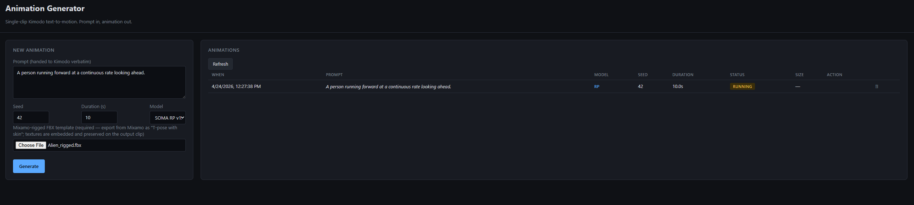
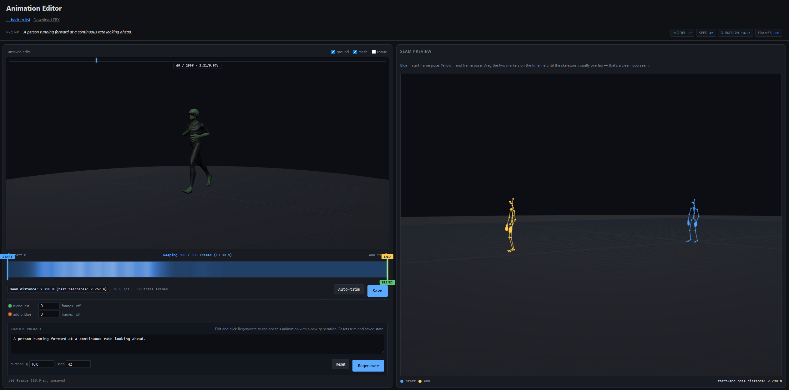

# Tutorial

A walk-through of the animation-builder UI, what every control does, and how to actually use it to produce good game animations.

This assumes you already got the stack running (see the main [README](../README.md) for setup).

---

## 1. The main page

When you open `http://localhost:7870` (or your server's hostname) you land on a two-pane page:

### Left pane — New animation

The form. Each field:

- **Prompt** — the text you hand to Kimodo. Handed verbatim, no massaging. Describe the motion directly. Example: `A person sprints forward at full speed, arms pumping, shoulders square, no turning`. Read the *Prompting* section at the bottom of this tutorial before you burn generations.

- **Seed** — integer that controls the random diffusion trajectory. Same prompt + same seed = exactly the same output. If a generation turns out weird, change the seed and try again. The seed is also saved on the animation so Rerun reproduces it.

- **Duration (s)** — how many seconds of motion to generate. Clips play at 30 fps, so 10 s = 300 frames. Longer doesn't always mean better (Kimodo often fills extra time with standing-still); 5-10 seconds is the usable range for most motions.

- **Model** — which Kimodo checkpoint to use. Two options:
  - **SOMA RP v1.1** — *Real Poses*. The realistic default. Trained on standard academic mocap. Most motion-test cases should start here.
  - **SOMA SEED v1.1** — *Seed*. More stylized / exaggerated motion. Try it when RP produces something too dry for your use case.

  Switching models the first time triggers a HuggingFace download of that model's weights (~1-2 GB). Subsequent switches are cached and only cost ~10 s of reload time.

- **Mixamo-rigged FBX template** — your character, **already rigged**. This needs to be a Mixamo-compatible humanoid FBX: a mesh with a standard Mixamo skeleton bound to it (`mixamorig:hips`, `mixamorig:spine`, etc.) with skin weights painted. The retargeter remaps Kimodo's SOMA skeleton onto Mixamo bones by name, so the rig has to match the expected naming convention.

  The simplest path is to use Mixamo directly: upload your raw character mesh to <https://www.mixamo.com>, run their auto-rigger, pick a pose (T-pose works fine), and download as FBX. Make sure you pick **"T-pose with skin"** on the download dialog — if you pick "without skin" or don't embed textures, the output clip imports into Unity as a white, skinless character. If you already have a Mixamo-rigged FBX from a previous project or from Adobe's character packs, you can reuse that without re-rigging.

  Non-Mixamo rigs (custom skeletons with different bone names) will not retarget correctly. Support for them would require remapping `SOMA_TO_MIXAMO` in `app/npz_to_fbx.py` to your bone names.

- **Generate** — submit the job. The server queues it and the page starts polling every 5 s.

### Right pane — Animations

Empty on first load. Once you submit a job it looks like:

Columns:
- **When** — submission timestamp, local time.
- **Prompt** — the text you sent, truncated with hover-tooltip for the full string.
- **Model** — short name (`RP` or `SEED`).
- **Seed** — the integer used.
- **Duration** — how long the requested clip is.
- **Status** — `running` (yellow), `completed` (green), `failed` (red).
- **Size** — exported FBX size in KB/MB once complete.
- **Action** — appears on completion:
  - **View / Edit** — opens the editor (covered next).
  - **Download** — saves the FBX directly to your machine.
  - **Rerun** — generates a new job with identical inputs (useful after you delete an animation and want it back).
  - **error** (red, hover for detail) — something went wrong, check the docker logs.
- **🗑** — delete. Removes the entry and all its data from the Docker volume. Can't be undone.

---

## 2. The editor

Click **View / Edit** on a completed animation.

Three regions:

### Header strip (top)
- `← back to list` — returns to the main page.
- **Download FBX** — direct download of the current FBX (same file View references).
- **Settings chips** — the prompt, model, seed, duration, frame count of the animation being viewed. Read-only info.

### Left viewer — 3D playback
The retargeted FBX playing on loop on your character. This is what will actually be in the exported file.

Above the canvas:
- **Playhead bar** — a slim strip at the top showing playback position. The vertical blue marker sweeps left-to-right in real time. When it wraps from right back to left, that's the loop seam — the moment to watch for pops or jerks.
- The label under the bar shows `currentFrame / totalFrames · currentTime/totalDuration` live.
- Click anywhere on the bar to scrub to that position.

Toolbar on top-right of the viewer:
- **ground** — toggle the ground grid.
- **mesh** — toggle the skinned mesh (useful if you want to see the skeleton bones only).
- **rotate** — auto-rotate the camera.

**Important detail:** The viewer updates on **Save**. Before Save, it plays the full raw clip clamped to `[start, end]`. After Save, it plays the actual exported clip (trimmed, blended, with any bridge frames appended).

### Right panel — Seam preview
A second 3D view showing two skeleton poses overlaid:
- **Blue** — the pose at the start frame.
- **Yellow** — the pose at the end frame.

The numerical readout underneath says `start↔end pose distance: X m`. Lower = tighter loop seam. Rotate (drag) and zoom (scroll) to inspect specific joints — useful for checking whether feet and hands line up even when body heights or locations differ.

Camera position persists across every trim-drag and save, so you can orbit once to find a useful angle and keep it.

---

## 3. The timeline

The blue bar below the main viewer is where most of the work happens.

### The gradient

The bar's color is driven by **per-frame pose distance to the start marker**. Dark blue means "this frame's pose is similar to the start frame"; lighter means "different". As you drag the **start** marker, the whole gradient recomputes from the new reference point.

Two things this does for you:

1. **Reveals stride cycles visually.** A jog or walk produces repeating dark bands — one per stride. Count the dark bands to count the strides. This is what the screenshot above shows.

2. **Shows you good end-frame candidates.** Any dark spot after your start marker is a frame whose pose matches your start frame. Those are the frames where an end marker would give a clean loop seam. Find the dark spot closest to the right edge that still leaves content (a natural one-cycle or multi-cycle span) and drag the end marker to it.

### The markers

Three draggable markers, all click-and-drag:

- **Start (blue)** — left boundary of the kept clip. Sits on top of the bar.
- **End (yellow)** — right boundary of the kept clip. Sits on top of the bar.
- **Blend (green)** — hangs *below* the bar. Controls how many frames of blend to apply. Drag left = more blend frames; drag right = fewer. When blend = 0, it sits on top of the end marker.

### The timeline stats
- **seam distance** — current start↔end pose distance and the "best reachable" seam distance if you kept the start where it is but moved end elsewhere. Lower is better.
- **fps · total frames** — the raw NPZ length.

### Auto-trim

Click **Auto-trim** to run an exhaustive pairwise search: for every possible `(start, end)` pair that's at least 1.5 s apart, compute the pose distance between them, keep the top 20 closest pairs, and pick the one with the longest span. You get "tight seam + maximum content" in one click.

A note: auto-trim doesn't always give you exactly what you want. It picks *a* good loop, not necessarily *the* loop your brain was looking at. On cyclic animations it's usually great; on noisy or irregular motion it can settle on a weird pair. If it picks something unhelpful, drag the markers manually — you usually don't need to hit auto-trim twice.

### Save

**Save** re-exports the FBX on the server to the current `[start, end]` with the current blend/bridge settings applied. The viewer reloads the FBX after save, so what you see playing switches from the full clip to the trimmed + blended version.

The button label reflects pending settings: `Save`, `Save (blend 20)`, `Save (+30)`, or `Save (blend 20, +30)`.

When the saved state exactly matches the current settings, the button reads `Saved ✓` and is disabled.

---

## 4. Blend vs Bridge

Two seam-closure modes. They solve different problems. You usually pick exactly one.

### Blend — for cyclical motions

Use for jog, walk, idle, sway, breathing — any motion where the character naturally returns to a similar pose every stride.

How it works: the last **N frames** of the kept clip are retroactively modified to smoothly ease toward the start-frame pose. Clip length stays the same; the last frame becomes *exactly* the start pose; looping from end to start is mathematically seamless.

How to use it: with the start and end markers placed, drag the green blend marker leftward until the left edge of the green fill lines up with the start of a visible stride cycle in the gradient. That's one clean stride of blend. Done.

Why this is cleaner than adding frames: the clip doesn't visibly slow down or wind into an ease-out at the end — motion plays at normal speed through the whole clip, but the last stride has been quietly reshaped to arrive at the start pose.

### Bridge — for one-way motions

Use for arm raises, door opens, reach-and-pick-ups, any motion where start and end are in *different places* and there is no natural cycle.

How it works: **N new synthesized frames** are appended after the end marker. Each bridge frame is a SLERP interpolation between end-pose and start-pose, spread evenly across the span. Clip length grows by N.

How to use it: set blend = 0, set bridge to a count that feels natural for the motion's speed (30-90 frames is common at 30 fps — 1 to 3 seconds of returning). The orange strip after the end marker shows how wide the bridge is.

In the screenshot: the character raises an arm out to the side. Start pose = arms down, end pose = arm extended. Blend wouldn't work here (there's no natural return in the clip), so bridge synthesizes the arm lowering.

---

## 5. Regenerate

Below the timeline is a prompt panel with Regenerate.

Edit the prompt, seed, or duration and click **Regenerate**. This **replaces the current animation in place** — same ID, same URL, same entry in the list, but with a freshly-generated NPZ + FBX. Useful when Kimodo gave you something weird and you want to try a tweak without flooding the list with new entries.

**Reset prompt** restores the prompt/duration/seed fields to the last-saved values if you changed your mind.

---

## 6. Prompting tips

Kimodo's prompt handling is the biggest source of "why didn't I get what I asked for?" frustration. The model was trained on academic mocap (AMASS), not a filtered gaming-animation dataset, so it has biases:

- **Duration words don't work.** "A person jogs for a long time" gives you 9 seconds of standing still and 1 second of jogging. The model can't read "long time." Use the `duration_s` slider to control clip length and describe only the motion in the prompt.

- **Start in the motion, not before it.** Phrases like "A person starts jogging" or "begins to sprint" tell the model there's a pre-motion state to represent — and it will usually burn your first few seconds on standing still. Prompt with the motion already in progress: "Running forward at full speed" or "Sprinting, arms pumping."

- **Short prompts beat long prompts.** `A person jogs forward at a steady pace, arms relaxed` beats `Imagine a person who has just decided to go for a jog on a sunny morning and is running at a steady pace with their arms relaxed by their sides`. The second version has too many tokens the model doesn't know what to do with.

- **Repeat the motion with periods if you keep getting warm-up.** Kimodo parses the prompt on `.` and treats each sentence as a separate sub-segment. `A person runs forward. A person runs forward. A person runs forward.` forces three running segments, giving the model fewer windows to fill with standing.

- **Seed roulette is real.** Some seeds land in warm-up-heavy attractors and some don't. If prompt tweaks aren't working, hit Rerun with different seeds (try 42, 100, 217, 500).

- **The model sometimes produces "combination clips."** Kimodo will occasionally generate a sequence of *several* actions strung together — a few seconds of walking, then a short idle, then a wave, then more walking — even when your prompt described a single motion. It's the model improvising from its training distribution. When this happens, use the timeline gradient to locate the segment that actually matches what you asked for and trim to that segment. Sometimes the clip won't contain your requested motion at all; regenerate with a different seed or shorter duration.

- **Generate longer than you need, then trim.** If you want 5 s of continuous running, ask for 10-15 s and trim the standing-still intro out. That's literally what the start marker is for.

- **Expect to regenerate.** Treat every generation as a draft. The trim + blend + regenerate workflow is the loop; budget 3-5 attempts per final clip.

---

## 7. Known limitations

- **Motion quality is bounded by Kimodo's training data.** Academic mocap doesn't have game-animation polish. You'll see the occasional mid-sprint pirouette, hands clipping through hips, or floaty jogs. The editor is designed to help you curate around this.

- **One generation at a time.** The GPU queue is single-slot. Concurrent requests wait.

- **Model switch cost.** Switching from SOMA-RP to SOMA-SEED (or back) reloads Kimodo (~10 s). Generations during the reload will queue.

- **HuggingFace on first model download.** First time you use a given model, the weights download lazily (~1-2 GB each). After the first download they live in the `hf_cache` Docker volume and reload is instant.
